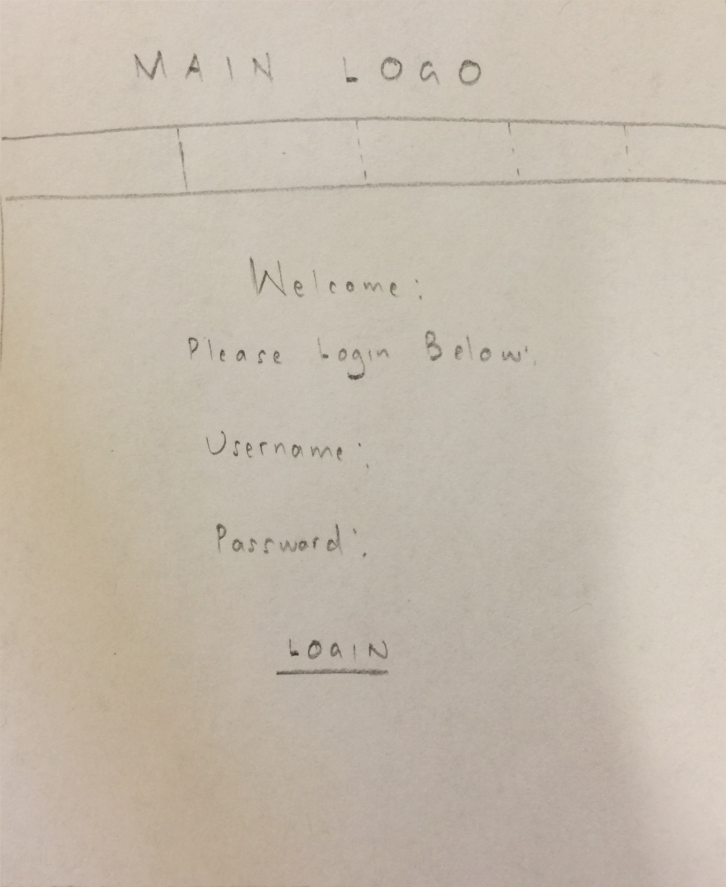
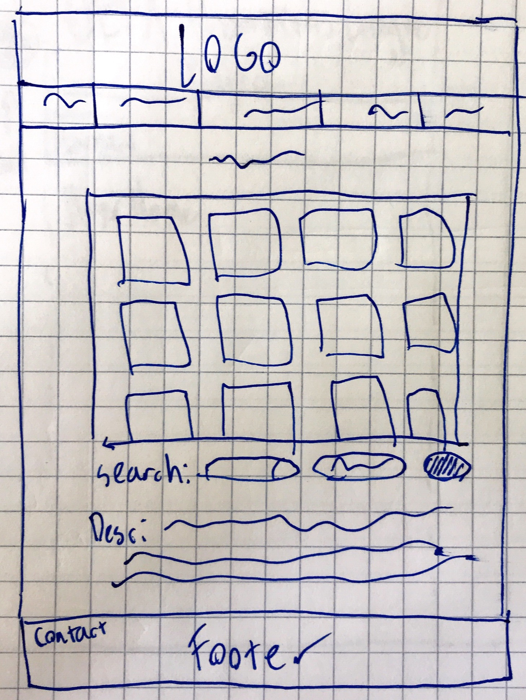
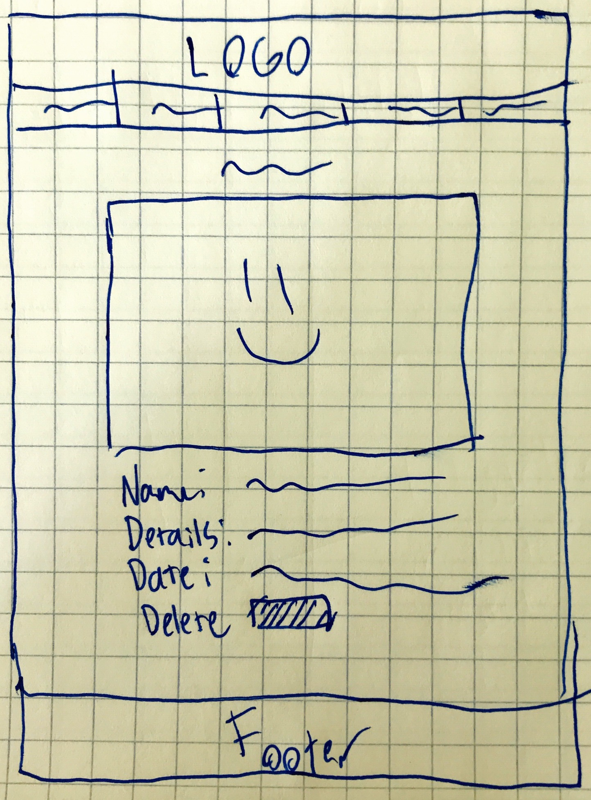
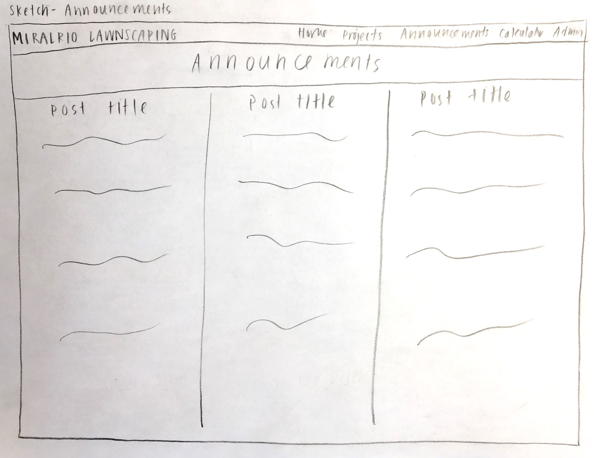
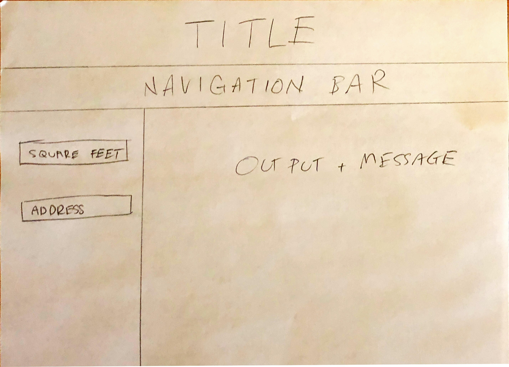
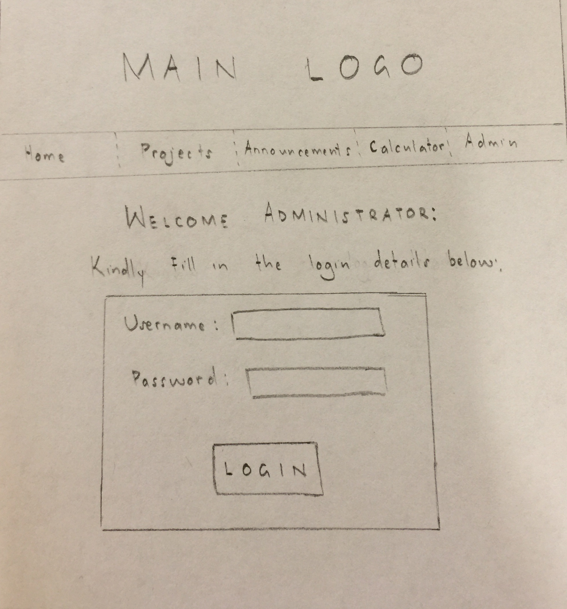
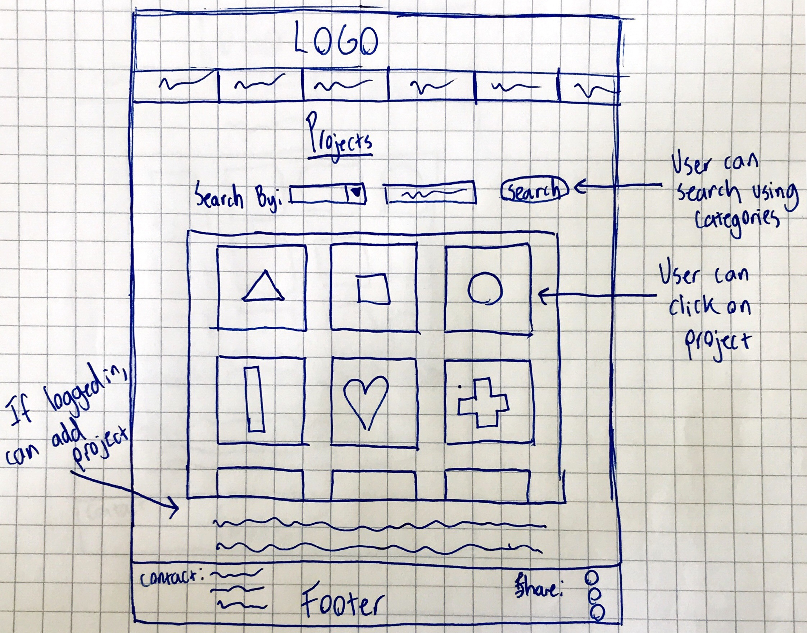
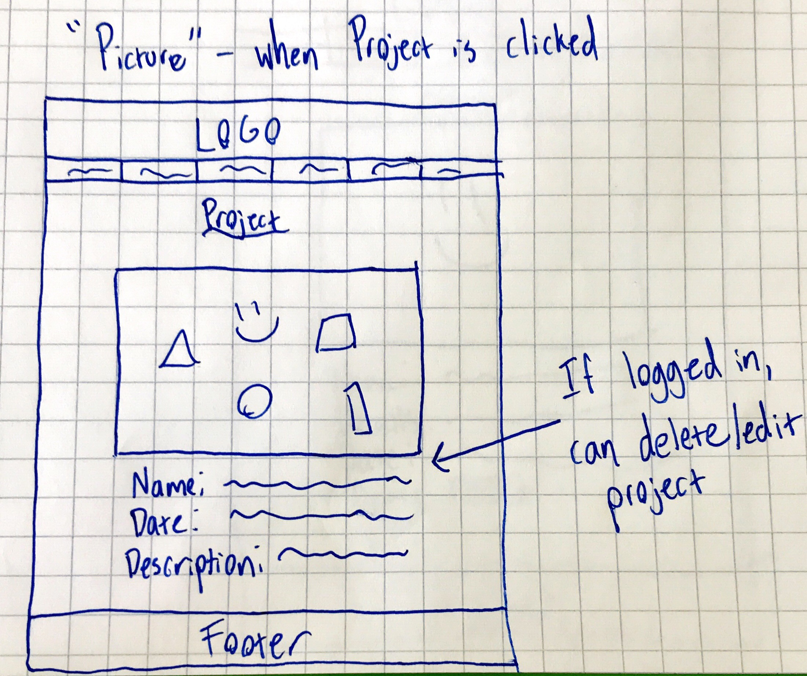
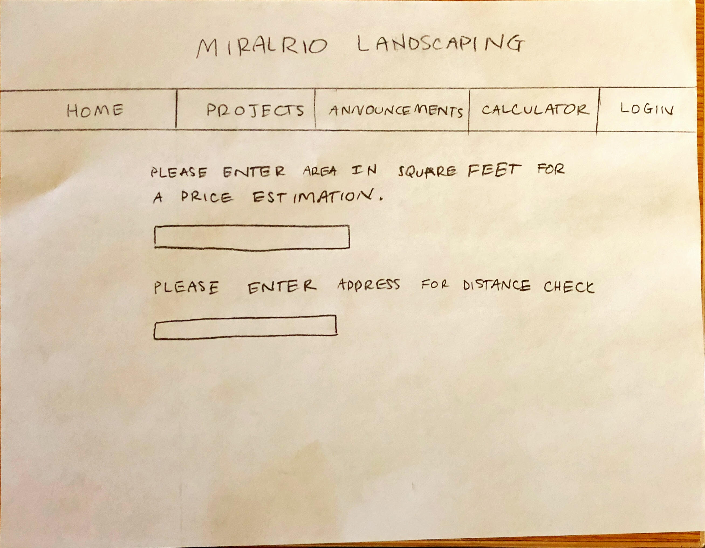

# Project 4 - Design & Plan

Your Team Name: [Yellow Tiger]

## Milestone 1, Part II: Client Selection

### Client Description

Our client is Mr. Miralrio who owns a landscaping business in Texas. He wants a website that can show the services that they offer, show pictures of previous jobs he has done, and allow uploads of new pictures of future jobs. His key goal is to use the website to advertise his business and attract new customers.

## Milestone 1, Part III: Client Requirements

### Target Audience(s)

The audience for this website would be landowners in need of landscaping work. The targeted audience would be able to interact with the site through friends' recommendations or social media outlets.

### Purpose & Content

The purpose of the website is to advertise Mr. Miralrio's business and display past landscaping works that he has done in order to attract more customers looking for his service.

### Needs and Wants

* Needs/Wants #1
  * **Needs and Wants**
    * Client wants to be able to show images of previous landscaping works
  * **Design Ideas and Choices**
    * Create a database of images that will display the pictures on specified webpage
  * **Memo**
    * We can implement this with the use of a database and corresponding photo gallery like in project 3

* Needs/Wants #2
  * **Needs and Wants**
    * Client wants to be able to update the site with new images
  * **Design Ideas and Choices**
    * Create a page that requires logging in that will allow upload of new images or deletion of old images
  * **Memo**
    * Logging in will allow the client to be the only one with the ability to modify the photos displayed

* Needs/Wants #3
  * **Needs and Wants**
    * Client wants to have a blog-like area that can be updated at their convenience to display announcements and event prices
  * **Design Ideas and Choices**
    * Create a page that requires logging in that will allow client to change display message
  * **Memo**
    * Logging in will allow the client to be the only one with the ability to modify the display messages and announcements

* Needs/Wants #4
  * **Needs and Wants**
    * Client wants to have a page that can provide a price estimation based on land area, to provide ease of access to potential customers rather than contacting by phone as the only method of acquiring estimates
  * **Design Ideas and Choices**
    * Create a page with embedded PHP code that can take user input and do math based on client's needs to display price estimation
  * **Memo**
    * This page would meet the needs of the client in providing more information to user

* Needs/Wants #5 (Google API was too complicated/costed $$)
  * **Needs and Wants**
    * Client wants to have a page that can calculate distances to determine whether the customer is farther than the client would be willing to travel in order to provide the service
  * **Design Ideas and Choices**
    * Create a page with embedded PHP code that can take user input and do math based on client's needs to display price      estimation
  * **Memo**
    * This page would meet the needs of the client in limiting the distances that they would be willing to travel

* Needs/Wants #6
  * **Needs and Wants**
    * Client wants users to have a clear idea of the types of projects they have through the project page
  * **Design Ideas and Choices**
    * Implement tags for the projects so users ca easily view particular types of projects
  * **Memo**
    * This page would meet the needs of the client by allowing more options for the user to view particular works - only the client will be able to add/delete tags


### Hosting Plan

Let the client know that we cannot host the website and that they need to find people to host it. Possibly do research on possible hosts for the website and refer the client towards them.

### Client's Edits

Yes, the client does need to be able to edit the site but only specific pages. We plan on having a login page solely for the client since users don't need to log on. This will allow them easy access in order to upload new images or delete old images as well as update the messages/announcements.

### Information Architecture, Content, and Navigation

* Content #1
  * **Main Navigation**
    * Index
  * **Sub-Categories**
    * Home
    * Services
    * Projects
    * Announcements
    * Distance/Price Calculator
    * Admin
  * **Content**
    * *Index*: Navigation to subpages
    * *Home*: Talks about the client's business and how to reach them
    * *Projects*: showcase past landscaping projects
    * *Announcements*: blog-like area that can display messages
    * *Calculator*: calculate price/distance to give an estimation to customers
    * *Admin*: allow client to login to update certain details

### Interactivity

[Interactive Features]

Will include photo gallery and blog that can be updated in the future
Includes a calculator that will calculate distance and output whether it is too far away
Includes a calculator that can give estimate on price based on lot size
Login for admin functions to update the website

[How these meet the needs of the client/audience]

Photo gallery and blog that can be updated meets the needs of the client to display older projects and announce special deals to customers

Calculator meets needs to make information easier to access rather than through a call or email

Login meets the client's needs to be able to update in the future

### External Code

Currently, I think we only need libraries for design to make the site look more modern and our own code will satisfy the majority of the project requirements

### Scale

Probably around 8 pages and maybe 48 hours of work modernizing design and making the webpage not look like base php

## Milestone 1, Part IV: Work Distribution

[Work Distribution]

Because most of the pages that we are including are very similar in functionality and just different in content, we will
likely split the pages evenly between us. This will also hopefully avoid possible merge conflicts. We will also design and
write the code to initialize our databases together because many of the pages will be using the same code. Once we determine
the final layout of our pages and subpages (like tags and picture in p3), we will also assign those subpages and related
pages to whoever is in charge of the parent page.

It is highly likely that some of us are interested in the functionalities of certain pages and others are interested in other functionalities, so we will take this into consideration when assigning responsibilities, but we will always strive to maintain an equal amount of work across all members. For example, if only one page has a map, each member will play a similar role in the development of it.

The design for the header and footer will be decided by all of us, but will be coded by one person to maintain consistency.

[Internal Deadlines]

One important thing to consider is styling - if we split up pages, we don't want some pages to vary wildly from others. We want
to be able to maintain a specific "theme" so the website is visually appealing. Thus, until we are able to have a full conversation with our client about how they want their website to look, we will decide on what HTML elements to include as well
as what to name them/what classes to give them ex. "content-wrap". This will allow us to style everything very similarly in the future.

Our init.php file and init.sql file are both extremely important because we will be integrating both into every single webpage.
Fortunately though, we have had a lot of practice with this in Project 3, so we plan to work together to knock these two out of the way as early as possible before we split up the other pages.

The header and footer are two of the pages that really don't have any dependencies on any other pages except for the navigation bar that we plan to include. Thus, whoever is in charge of the header/footer will have to code a barebones version of an interactive navigation bar so that it is easier for us to test and troubleshoot the rest of the pages.

#### For Milestone 1, we had the following plan:
Wednesday 11th - Group members meet up and exchange information after class. all members tasked with looking for client.

Friday 13th - Meet up after lab at Duffield and discuss different client options and pick one.
Finalize Team contract.
Make Schedule for contacting client.

Saturday 14th - Alan contacts client.
Meeting at Olin to gather information on the website, pages and various divisions e.t.c.

Monday 16th - Deadline to submit edits to online Google Doc.

Tuesday 17th - Upload Changes to Git.
Each member runs over the changes.
Changes uploaded to Git Repo.

## Milestone 2, Part I: PHP Interactivity

Administrator page for client which will be done with PHP and will use PHP conditional statements so certain functions are only shown once you are logged into the administrator page.
Ex.
- Adding new projects
- Deleting old projects
- Editing old projects

Price estimation calculator based on size of lot/lawn that the customer is requesting service for. Will use a simple math function based on specifications of the client. Math function takes input (number) and multiplies by variable(price) and then outputs so that the customer can get an estimation on price. The price variable will be updatable when the client logs into the admin page.

Distance function, we will figure out how to calculate distance since the client doesn't want to have to travel too far to provide his landscaping service because the landscaping business he owns is local. It will probably use a google library and include a function to calculate distance between the client's home and the customer's inputted location.

## Milestone 2, Part II: Sketches, Navigation & Wireframes

### Sketches

[Insert your sketches here.]












### Navigation

* Home
* Projects
* Announcements
* Calculator
  * Output page
* Login Page (Top-level)
  * Administrator functions (Sub-page)
* Projects
  * Picture

### Wireframes

[Insert your wireframes here.]












## Milestone 2, Part III: Evaluate your Design

[Use the GenderMag method to evaluate your wireframes.]

[Pick a persona that you believe will help you address the gender bias within your design.]

I've selected **[Abby]** as my persona.

I've selected my persona because Abby represents a large percentage of computer users who have low confidence about doing unfamiliar computing tasks and are also risk averse about using unfamiliar technologies. This forces us to create an easy to use website that is user-friendly to all, even users like Abby, have a comprehensive information processing style and use process-oriented learning. Using Abby as a persona also helps us overcome any gender-related biases we may encounter in our design.

### Tasks

[You will need to evaluate at least 3 tasks (known as scenarios in the GenderMag literature). List your tasks here. These tasks are the same as the task you learned in INFO/CS 1300.]

[For each task, list the ideal set of actions that you would like your users to take when working towards the task.]

Task 1: Customer wants to see photos and examples of past projects

  1. Click on Projects
  2. Scroll through pictures and choose specific projects they want to see
  3. Observe pictures  

Task 2: Client wants to log in to access admin privileges

  1. Click on Admin
  2. Log in with provided username and password
  3. Given access to extra functionalities

Task 3: Customer wants to see events/announcements

  1. Click on announcements
  2. View available announcements posted by client

### Cognitive Walkthrough

[Perform a cognitive walkthrough using the GenderMag method for all of your Tasks. Use the GenderMag template in the <documents/gendermag-template.md> file.]

#### Task 1 - Cognitive Walkthrough

**Task name: [View Photos]**

[Add as many subgoals as you needs]
**Subgoal # [1] : [Navigate to correct page]**

  - Will [Abby] have formed this sub-goal as a step to their overall goal?
    - Yes
    - Why? (Especially consider [Abby]'s Motivations/Strategies.)

        [Because the navigation to the page page is labelled and clearly presented, it will allow Abby to easily find where the photos are and navigate there.]

[Add as many actions as you need...]
**Action # [1] : [Click on Projects button]**

  - Will [Abby] know what to do at this step?
    - Maybe
    - Why? (Especially consider [Abby]'s Knowledge/Skills, Motivations/Strategies, Self-Efficacy and Tinkering.)

        [Abby is familiar with technology and is comfortable with information being presented clearly to her, but Projects doesn't convey that the page will contain images.]

  - If [Abby] does the right thing, will she know that she did the right thing, and is making progress towards her goal?
    - Yes
    - Why? (Especially consider [Abby]'s Self-Efficacy and Attitude toward Risk.)

        [While Abby has low computer self-efficacy and attitude toward risk, once she clicks on Projects she will be greeted by a photo gallery that shows the different projects the client has worked on and will know immediately that she is at the correct page.]

**Subgoal # [2] : [View individual photos]**

  - Will [Abby] have formed this sub-goal as a step to their overall goal?
    - Yes
    - Why? (Especially consider [Abby]'s Motivations/Strategies.)

        [Her main goal is to see the photos so this is an extension and more specified step towards her main goal, so she will form this sub-goal as a step towards viewing photos.]

**Action # [1] : [Click on photos presented]**

  - Will [Abby] know what to do at this step?
    - Yes
    - Why? (Especially consider [Abby]'s Knowledge/Skills, Motivations/Strategies, Self-Efficacy and Tinkering.)

        [Since her sub-goal is to view photos, and the photo gallery presents small images, she will instinctively click on the photos to attempt to zoom in which will direct her to a new page to view the image alone.]

  - If [Abby] does the right thing, will she know that she did the right thing, and is making progress towards her goal?
    - Yes
    - Why? (Especially consider [Abby]'s Self-Efficacy and Attitude toward Risk.)

      [Once she clicks on the photo presented by the photo gallery she will be presented with the image alone and magnified, signalling that she has done the correct thing and accomplished her goal.]

*Source*: Margaret Burnett, Simone Stumpf, Laura Beckwith, and Anicia Peters, "The GenderMag Kit: How to Use the GenderMag Method to Find Inclusiveness Issues through a Gender Lens", http://gendermag.org, Feb. 1 2018 .

#### Task 2 - Cognitive Walkthrough

**Task name: [Access Administrator Privileges]**

[Add as many subgoals as you needs]
**Subgoal # [1] : [Navigate to Admin page]**

  - Will [Abby] have formed this sub-goal as a step to their overall goal?
    - Yes
    - Why? (Especially consider [Abby]'s Motivations/Strategies.)

        [Abby is comfortable and has worked with technology before and will know that in order to access administrator functions she would need to click on the Admin page.]

[Add as many actions as you need...]
**Action # [1] : [Click on Admin]**

  - Will [Abby] know what to do at this step?
    - Yes
    - Why? (Especially consider [Abby]'s Knowledge/Skills, Motivations/Strategies, Self-Efficacy and Tinkering.)

        [Because she is familiar with how computers work and knows that if she wants to get to the admin page she should click admin on the navigation bar.]

  - If [Abby] does the right thing, will she know that she did the right thing, and is making progress towards her goal?
    - Yes
    - Why? (Especially consider [Abby]'s Self-Efficacy and Attitude toward Risk.)

        [She will be greeted with a login page and message that prompts her to log in to the page.]

**Action # [2] : [Login]**

  - Will [Abby] know what to do at this step?
    - Yes
  - Why? (Especially consider [Abby]'s Knowledge/Skills, Motivations/Strategies, Self-Efficacy and Tinkering.)

      [Because she is familiar with how computers work, she'll understand that she should log in before accessing admin functions.]

  - If [Abby] does the right thing, will she know that she did the right thing, and is making progress towards her goal?
    - Yes
    - Why? (Especially consider [Abby]'s Self-Efficacy and Attitude toward Risk.)

        [Abby will know she did the right thing since the new functions will be revealed, confirming that she has accomplished her goal.]

*Source*: Margaret Burnett, Simone Stumpf, Laura Beckwith, and Anicia Peters, "The GenderMag Kit: How to Use the GenderMag Method to Find Inclusiveness Issues through a Gender Lens", http://gendermag.org, Feb. 1 2018 .

#### Task 3 - Cognitive Walkthrough

**Task name: [View Announcements]**

[Add as many subgoals as you needs]
**Subgoal # [1] : [Navigate to Announcements page]**

  - Will [Abby] have formed this sub-goal as a step to their overall goal?
    - Yes
    - Why? (Especially consider [Abby]'s Motivations/Strategies.)

        [Abby is comfortable and has worked with technology before and will know that in order to view announcements she must navigate to a new page, which she will determine is the Announcements page in the navigation bar.]

[Add as many actions as you need...]
**Action # [1] : [Click on Announcements in navigation bar]**

  - Will [Abby] know what to do at this step?
    - Yes
    - Why? (Especially consider [Abby]'s Knowledge/Skills, Motivations/Strategies, Self-Efficacy and Tinkering.)

        [Because she is familiar with how computers work and knows that if she wants to get to the announcements page she should click announcements on the navigation bar.]

  - If [Abby] does the right thing, will she know that she did the right thing, and is making progress towards her goal?
    - Yes
    - Why? (Especially consider [Abby]'s Self-Efficacy and Attitude toward Risk.)

        [Yes, the heading will change to Announcements and she will also see the announcements posted by the client]


### Cognitive Walk-though Results

[Did you discover any issues with your design? What were they? How did you change your design to address the gender-inclusiveness bugs you discovered?]

The design feels a little bit simple and the Projects page might be a little bit confusing since it doesn't convey that there will be photos on that page. We might want to rename it. There aren't any major gender-inclusiveness issues since this is a very simple design and layout.

[Your responses here should be very thorough and thoughtful.]

## Milestone 2, Part IV: Database Plan

### Database Schema

Table: Projects
* field 1: image_id (Integer, Unique, primary key, not null, AI)
* field 2: image_name (text, not null)
* field 3: image_ext (text, not null)
* field 4: project_name (text, unique, not null)
  - Unique project names to prevent duplicate entries
  - Owner stated no projects have the same name, so it is viable
* field 5: details (text)
* field 6: date (text)

Table: Users
* field 1: id (Integer, unique, primary key, not null, AI)
* field 2: username (text, not null)
* field 2: password (text, not null) *hashed*
* field 4: session (text, unique)

### Database Queries

*Sanitize/filter everything before using it in queries. Heavily protect against SQL injection*

1. Retrieve all projects: select * from projects
2. Viewing details for a single project: select * from projects where image_id = (image id we receive from GET)
3. Searching: depends on what category the user chooses (name, date, description), modify the query to search for the keyword after filtering and sanitizing
 - select * from projects where (name, date, description) LIKE (user input)
4. Deleting project: delete project from database and also unlink it so we are deleting from disk too
5. Updating project details: Update selected category in database with whatever the user enters (after filtering and sanitizing)
6. Login: selecting unique and exact username from db to see if exists, and then comparing password entered to the one in the db
7. Logout: search for username in the db to access session_id, and then removing it/setting it to null
8. Creating a session: selecting username from users db, creating a session in PHP and then inserting it into the db under session_id


## Milestone 2, Part V: Structure and Pseudocode

### Structure

[List the PHP files you will have. You will probably want to do this with a bulleted list.]

* index.php - main page.
* includes/init.php - stuff that useful for every web page.
* includes/header.php
* includes/footer.php
* projects.php
* picture.php
* announcements.php
* calculator.php
* adminlogin.php

### Pseudocode

[For each PHP file, plan out your pseudocode. You probably want a subheading for each file.]

#### index.php

```
include init.php

include header.php

images subheading

Display welcome messages

Display images and Services

include footer.php
```

#### includes/init.php

```
messages = array to store messages for user (you may remove this)


db = connect to db
function = exec_sql_query
#### includes/init.php

print_messages function
login function
logout function

pages = array to store pages


```

#### projects.php

```
include init.php
include header.php

Query all of the projects in the projects database and display them in a table as
links. Users will be able to click on any image and be redirected to the pictures
page where they can view all of the details of the project.

Search bar at the top of the project gallery will have a "search by" option
drop-down menu where a user can select to search for a project by either its
name, details, date, or any other information that will be available. Will be
using POST and sanitizing/filtering user input before executing any SQL queries.

Owner will see an option and be able to upload projects as long as they are
logged in.
```

#### picture.php

```
include init.php
include header.php

filter and sanitize project ID once we GET it

image: use GET to get the image ID from address bar and then query projects
table to display the image using its name and extension

image details: echo the rest of the database categories that we returned for our
image (name, date, details, etc.)

If logged in: (display delete image and edit details)
Owner will see an option to and be able to delete a project/edit its details as
long as they are logged in

Make sure to refresh page/query after each deletion/edit to update
accordingly
```

#### announcements.php
```
include init.php

include header.php

echo posts inputted into admin page by admin

Announcements that the admin posts through the admin page appear on the screen.


```

#### calculator.php
```
include init.php

include header.php

calculator subheading

Input forms for square feet and address

POST input and execute php functions

2 PHP functions, one to multiply square feet by price and the other calculating distance

include footer.php

```

#### adminlogin.php
```
include init.php

include header.php

login subheading

Make Login form

if username + password = true:
  create session
  update accounts table and set session with user_id
Result = execute sql Query
set cookie using session and time

check login for every time page is loaded

include footer.php

```


## Milestone 2, Part VI: Additional Comments

[Add any additional comments you have here.]


## Milestone 3: Updates

[If you make any changes to your plan or design, make a list of the changes here.]
1. Database Schema
- Added a "Project Name" field to the projects database to include a unique name for each project (as the owner said that no projects have the same name), and this will help prevent accidental duplicate entries as per theTA's feedback.


## Milestone 4: Updates

[If you make any changes to your plan or design based on your peers' feedback, make a list of the changes here.]

Our TAs suggested looking into tags for the projects so users can easily look at specific types of work that our client has done. We decided to implement this through our databases and added functionality for adding/deleting tags. As such, the Database Schema changes to the following:

### Database Schema

Table: Projects
* field 1: id (Integer, Unique, primary key, not null, AI)
* field 2: image_name (text, not null)
* field 3: image_ext (text, not null)
* field 4: project_name (text, unique)
  - Unique project names to prevent duplicate entries
  - Owner stated no projects have the same name, so it is viable
* field 5: details (text)
* field 6: date_up (text)

Table: Users
* field 1: id (Integer, unique, primary key, not null, AI)
* field 2: username (text, not null)
* field 2: password (text, not null) *hashed*
* field 4: session (text, unique)

Table: Tags
* field 1: tag_id (Integer, unique, primary key, not null, AI)
* field 2: tag (text, not null, unique)

Table: Project Tags
* field 1: id (Integer, unique, primary key, not null, AI)
* field 2: project_id (text, not null)
* field 2: tag_id (text, not null)

Table: Prices
* field 1: id (Integer, unique, primary key, not null, AI)
* field 2: name (text, not null)
* field 2: price (integer, not null)

We also worked on adding and deleting images which wasn't functional at the time our peers saw our work.

Moreover, overtime we updated our Navigation to the following:
* **Main Navigation**
  * Index
* **Sub-Categories**
  * Home
  * Services
  * Projects
  * Announcements
  * Admin
* **Content**
  * *Index*: Navigation to subpages
  * *Home*: Talks about the client's business and how to reach them
  * *Projects*: showcase past landscaping projects
  * *Announcements*: blog-like area that can displlay messages
  * *Admin*: allow client to login to update certain details
  * *Login/Logout*: allow administrator to login and logout to accesss special functionalities


## Milestone 5: Cognitive Walkthrough

[Copy your tasks here from Milestone 2. Update them if you need to and then conduct another cognitive walkthrough.]

The following are the tasks used in the cognitive walkthrough:
Task 1: Customer wants to see photos and examples of past projects

  1. Click on Projects
  2. Scroll through pictures and choose specific projects they want to see
  3. Observe pictures  

Task 2: Client wants to log in to access admin privileges

  1. Click on Admin
  2. Log in with provided username and password
  3. Given access to extra functionalities

Task 3: Customer wants to see events/announcements

  1. Click on announcements
  2. View available announcements posted by client

#### Task 1 - Cognitive Walkthrough

**Task name: [View Projects]**
**Subgoal # [1] : [Navigate to correct page]**

  - Will [Abby] have formed this sub-goal as a step to their overall goal?
    - Yes
    - Why? (Especially consider [Abby]'s Motivations/Strategies.)

      [Because the navigation to the Projects page page is labelled and clearly presented, it will allow Abby to easily find where the projects are and navigate there.]

**Action # [1] : [Click on Projects button]**

  - Will [Abby] know what to do at this step?
    - Maybe
    - Why? (Especially consider [Abby]'s Knowledge/Skills, Motivations/Strategies, Self-Efficacy and Tinkering.)

      [Abby is familiar with technology and is comfortable with information being presented clearly to her, but Projects doesn't convey that the page will contain images.]

  - If [Abby] does the right thing, will she know that she did the right thing, and is making progress towards her goal?
    - Yes
    - Why? (Especially consider [Abby]'s Self-Efficacy and Attitude toward Risk.)

      [While Abby has low computer self-efficacy and attitude toward risk, once she clicks on Projects she will be greeted by a photo gallery that shows the different projects the client has worked on and will know immediately that she is at the correct page.]

**Subgoal # [2] : [View individual projects]**

  - Will [Abby] have formed this sub-goal as a step to their overall goal?
    - Yes
    - Why? (Especially consider [Abby]'s Motivations/Strategies.)

      [Her main goal is to see the individual projects. As such, this is an extension and more specified step towards her main goal, so she will form this sub-goal as a step towards viewing projects.]

**Action # [1] : [Click on photos presented]**

  - Will [Abby] know what to do at this step?
    - Yes
    - Why? (Especially consider [Abby]'s Knowledge/Skills, Motivations/Strategies, Self-Efficacy and Tinkering.)

      [Since her sub-goal is to view photos, and the photo gallery presents small images, she will instinctively click on the photos to attempt to zoom in which will direct her to a new page to view the image alone.]

  - If [Abby] does the right thing, will she know that she did the right thing, and is making progress towards her goal?
    - Yes
    - Why? (Especially consider [Abby]'s Self-Efficacy and Attitude toward Risk.)

      [Once she clicks on the photo presented by the photo gallery she will be presented with the image alone and magnified, showing that she has done the correct thing and accomplished her goal. She will get further information about the project and various tags on it.]

*Source*: Margaret Burnett, Simone Stumpf, Laura Beckwith, and Anicia Peters, "The GenderMag Kit: How to Use the GenderMag Method to Find Inclusiveness Issues through a Gender Lens", http://gendermag.org, Feb. 1 2018 .

#### Task 2 - Cognitive Walkthrough

**Task name: [Access Administrator Privileges]**

**Subgoal # [1] : [Navigate to Admin page]**

  - Will [Abby] have formed this sub-goal as a step to their overall goal?
    - Yes
    - Why? (Especially consider [Abby]'s Motivations/Strategies.)

      [Abby is comfortable and has worked with technology before and will know that in order to access administrator functions she would need to click on the Admin page.]

**Action # [1] : [Click on Admin]**

  - Will [Abby] know what to do at this step?
    - Yes
    - Why? (Especially consider [Abby]'s Knowledge/Skills, Motivations/Strategies, Self-Efficacy and Tinkering.)

      [Because she is familiar with how web navigation works and knows that if she wants to get to the admin page she should click admin on the navigation bar.]

  - If [Abby] does the right thing, will she know that she did the right thing, and is making progress towards her goal?
    - Yes
    - Why? (Especially consider [Abby]'s Self-Efficacy and Attitude toward Risk.)

      [She will be greeted with a login option, a button that redirects her to the login page and message that prompts her to log in to the page.]

**Action # [2] : [Login]**

  - Will [Abby] know what to do at this step?
    - Yes
  - Why? (Especially consider [Abby]'s Knowledge/Skills, Motivations/Strategies, Self-Efficacy and Tinkering.)

    [Because she knows that the administrator of a website is usually granted special privileges, she'll understand that she should log in before accessing admin functions.]

  - If [Abby] does the right thing, will she know that she did the right thing, and is making progress towards her goal?
    - Yes
    - Why? (Especially consider [Abby]'s Self-Efficacy and Attitude toward Risk.)

      [Abby will know she did the right thing since the new functions will be revealed, confirming that she has accomplished her goal. She will be able to access the full functionalities of the Administrator page.]

*Source*: Margaret Burnett, Simone Stumpf, Laura Beckwith, and Anicia Peters, "The GenderMag Kit: How to Use the GenderMag Method to Find Inclusiveness Issues through a Gender Lens", http://gendermag.org, Feb. 1 2018 .

#### Task 3 - Cognitive Walkthrough

**Task name: [View Announcements]**

**Subgoal # [1] : [Navigate to Announcements page]**

  - Will [Abby] have formed this sub-goal as a step to their overall goal?
    - Yes
    - Why? (Especially consider [Abby]'s Motivations/Strategies.)

      [Abby is comfortable and has worked with technology before and will know that in order to view announcements she must navigate to a new page, which she will determine is the Announcements page in the navigation bar.]

**Action # [1] : [Click on Announcements in navigation bar]**

  - Will [Abby] know what to do at this step?
    - Yes
    - Why? (Especially consider [Abby]'s Knowledge/Skills, Motivations/Strategies, Self-Efficacy and Tinkering.)

      [Because she is familiar with how website navigation works, she knows that if she wants to get to the announcements page she should click announcements on the navigation bar.]

  - If [Abby] does the right thing, will she know that she did the right thing, and is making progress towards her goal?
    - Yes
    - Why? (Especially consider [Abby]'s Self-Efficacy and Attitude toward Risk.)

      [Yes, the hover-heading will change to Announcements and she will also see the announcements posted by the client.]


### Cognitive Walk-though Results

[Did you discover any issues with your design? What were they? How did you change your design to address the gender-inclusiveness bugs you discovered?]
Initially in milestone 2, we had the "Admin" page only appear on the navigation bar when the user was logged in. As such, many users would not be aware of this function, and administrators would have a hard time determining where the Admin Functions could be accessed through.
To fix this, we added the Admin option to the navigation bar and restricted access to only logged in administrators.

Also, in earlier milestones, we had not implemented the hover function over our projects(the pictures). As such, some users wouldn't be able to discern that the projects were indeed clickable in order to view further information about them.
To fix this, we implemented a hover function over the project images and also put a message at the top of the screen informing the users that they should click on the images in order to view further details about the different projects.


## Milestone 5: Final Notes to the Clients

[Describe in some detail what the client will do (or would have to do) in order to make this website go live. What is the deployment plan?]

In order to make the website go live, the client will have to follow these steps:

1. Chose a domain name - in this case, the client has an existing domain name and can use it.
2. Register domain name - the domain name is already registered.
3. Find a Web Hosting Company e.g. GoDaddy to host he website and database on.
4. Upload files(project images and details) into the database.
5. Set up Database and configure credentials of the database files.

By following these steps, the client will be able to fully upload and actively manage their website.

As for the needs of the user, we were able to meet all of the aforementioned needs(Milestone 1), apart from implementing the distance function calculator. The client had requested a Distance function that would calculate distance from the client's location to his customers since the client doesn't want to have to travel too far to provide his landscaping service.

We were unable to implement this as the Google API that enables this service requires mass importation and various Payments which would have forced us to go over the size limit of the website and also had financial bearing.

## Milestone 5: Final Notes to the Graders

[1. Give us three specific strengths of your site that sets it apart from the previous website of the client (if applicable) and/or from other websites. Think of this as your chance to argue for the things you did really well.]

Sorting through projects - Previously, users were only able to see pictures of projects. No details were provided on particular projects or the different types of work from the client. Now, we have tags to help users sort through their work and clicking on projects shows information beyond the picture.

Price estimation - Previously, customers would have to contact the client to get a price quote. Now, with functionality to get an estimate, more engagement with the client's services is encouraged. With less steps involved to get landscaping done, the price estimations will hopefully lead to more business.

Presenting all types of services - Previously, the website laid out the types of projects in a way that didn't allow everything to be viewed at once. Customers couldn't get a quick glance of what the client offered. Now, with the home page and clear tags, the user knows the services offered and how each one should like.


[2. Tell us about things that don't work, what you wanted to implement, or what you would do if you keep working with the client in the future. Give justifications.]

We had earlier intended to include a distance calculator function that would calculate distance from the client's location to his customers since the client doesn't want to have to travel too far to provide his landscaping service.

We were unable to implement this as the Google API that enables this service requires mass importation and various Payments which would have forced us to go over the size limit of the website and also had financial bearing.

We gave the client the option of allowing us to implement this functionality to the final website, provided that he covered all financial costs of importing the Google API.

[3. Tell us anything else you need us to know for when we're looking at the project.]
